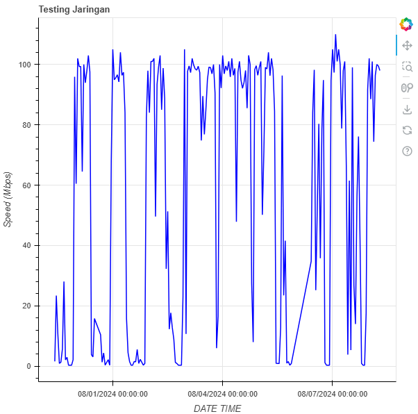

# Visualisasi Hasil Iperf Menggunakan Bokeh (Line Chart)

Script ini digunakan untuk membaca hasil pengujian jaringan **iperf** yang disimpan dalam file teks (`data.txt`), mengekstrak **timestamp** dan **bitrate** dari bagian *sender summary*, kemudian memvisualisasikannya sebagai **line chart** menggunakan [Bokeh](https://bokeh.org/).

## ⚙️ Instalasi
Pastikan Python 3.x sudah terinstall di sistem Anda.  
Kemudian install dependensi yang dibutuhkan:
```bash
pip install bokeh
```

## ▶️ Cara Menjalankan
1. Pastikan file `data.txt` berada di direktori yang sama dengan script.
2. Jalankan script:
```bash
python main.py
```
atau
```bash
python3 main.py
```
3. Setelah script berjalan, file HTML `main.html` akan dihasilkan dan otomatis dibuka di browser.

## 📝 Format Data yang Dibaca
Script ini akan mencari pola seperti berikut pada file `data.txt`:

```
Timestamp: 2024-07-30 10:23:42
...
[  5]   0.00-10.00  sec  1.13 MBytes   949 Kbits/sec    0             sender
```

- **Timestamp** diambil dari baris yang diawali `Timestamp:`.
- **Bitrate** diambil dari baris *sender summary* (total 0.00–10.00 sec).
- Jika satuan adalah `Kbits/sec`, maka akan dikonversi ke `Mbits/sec`.

## 📊 Hasil Grafik
- **X-axis**: Tanggal & Waktu (`datetime`)
- **Y-axis**: Kecepatan (Mbps)
- Format label waktu: `MM/DD/YYYY HH:MM:SS`

Contoh tampilan:



## ✏️ Kustomisasi
- **Warna garis**: Ubah parameter `color` pada fungsi `p.line()`.
- **Ketebalan garis**: Ubah `line_width` pada `p.line()`.
- **Format tanggal**: Ubah `DatetimeTickFormatter` di bagian `p.xaxis.formatter`.

## 📄 Lisensi
Proyek ini bebas digunakan untuk tujuan pribadi maupun edukasi.